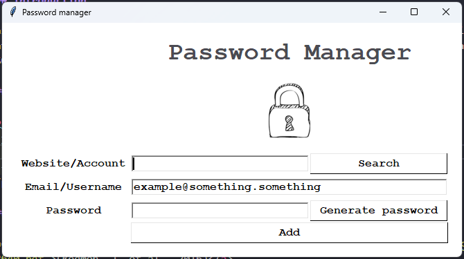

  
Table of Contents

  <ol>
    <li>
      <a href="#introduction">Introduction</a>
    </li>
    <li><a href="#demo">Demo</a></li>
    <li><a href="#technical-tools">Technical Tools</a></li>
    <li><a href="#how-to-use-the-source-code">How to use the source code</a></li>
  </ol>

### Introduction

This repository houses the source code for a simple Python project with Graphical User Interface (GUI), named PasMan. It is designed to generate and store complex passwords in a JSON file.

### Demo

  

### Technical tools

-   tkinter
-   json

### How to use the source code

-   Only python3 is required for this source code
